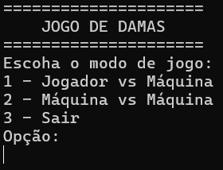
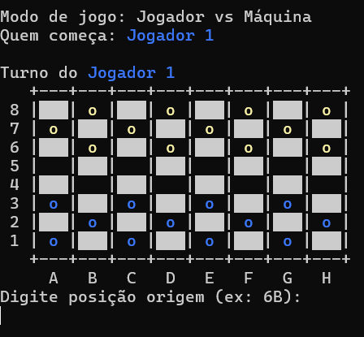
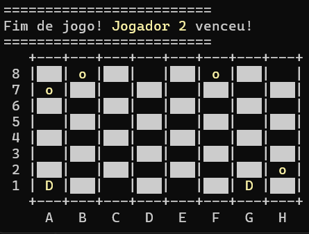

# JOGO DE DAMAS EM HASKELL

Este projeto consiste em uma implementação completa do jogo de Damas, desenvolvida em **Haskell**, com suporte a regras oficiais, múltiplas capturas, promoção para dama e uma **IA básica** para jogadas automáticas.

---

## Objetivo

Explorar os conceitos da **programação funcional** aplicados no desenvolvimento de um jogo de tabuleiro clássico. O projeto também serviu como prática em estruturas recursivas, imutabilidade, funções puras e manipulação de listas.

---

## Funcionalidades

- Criação e exibição do tabuleiro
- Movimentação de peças
- Regras de captura obrigatória
- Múltiplas capturas sequenciais
- Promoção de peças a "Damas" (peças que se movimentam em todas as direções)
- Detecção de fim de jogo
- Modo jogador vs jogador ou jogador vs IA
- IA simples com heurística baseada em número de capturas

---

## Estrutura do Projeto

src/
├── Tabuleiro.hs -- Representação e manipulação do tabuleiro
├── Jogador.hs -- Tipos e lógica de jogadores
├── Regras.hs -- Regras do jogo e movimentos permitidos
├── Captura.hs -- Algoritmo de busca por múltiplas capturas
├── IA.hs -- Implementação de uma IA simples
└── Main.hs -- Entrada principal do jogo

## Instruções

Certifique-se de ter o **GHC** e **Cabal** instalados.

### Comandos

Execute os comandos abaixo na raiz do projeto:

- cabal build
- cabal repl
- main

## Exemplos de conceitos funcionais aplicados

- Imutabilidade: o tabuleiro é sempre transformado em uma nova versão após cada jogada.
- Recursão: usada para encontrar sequências de capturas múltiplas.
- Funções puras: a maioria das funções não depende de estado global.
- Composição de funções: permite manipular listas e estados do jogo de forma elegante.
- Tipos algébricos (ADTs): utilizados para representar peças, jogadas e estados do jogo.

## Observação

Para mais informações sobre o desenvolvimento, pode acessar o arquivo "Relatório - Jogo de Damas em Haskell" na raiz do projeto
